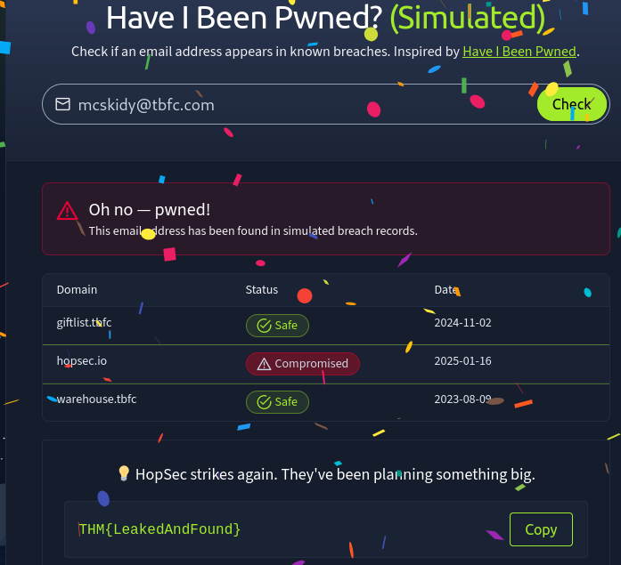

# Warm-Up

# Introduction

### Let's Get Warmed Up

The snow has started falling in **Wareville**, home of The Best Festival Company (TBFC). The team is preparing for SOCMAS, the annual cyber celebration, but something’s not right. Systems are glitching, passwords are failing, and McSkidy suspects something is afoot. This name keeps coming up: **King Malhare**. What could it mean?

Before joining the **SOCMAS Response Team**, you can complete **10 short missions** to ensure you are ready. Each one teaches an essential cyber security skill and uncovers clues to help get you ready for Advent of Cyber 2025.

### How it Works

To start each challenge, click the “**View Site**” button in the top-right corner of the task page. You’ll need to press this button **again for every new task**, as each one loads its own challenge site. Once clicked, the room will open in a **split-screen view**, letting you follow the instructions on the left while interacting with the challenge on the right. This is where you’ll complete all of our interactive challenges to get you ready for this year's event!

# Challenge 1 - Password Pandemonium

Password Pandemonium

As you log into your new TBFC workstation, an alert pops up:

```
“Weak passwords detected on 73 TBFC accounts!”

```

Even McSkidy’s password, P@ssw0rd123, has been flagged. Before gaining full access, you’ll need to prove your password prowess.

Strong passwords are one of the simplest yet most effective defences against cyber attacks.

Objective:
Create a password that passes all system checks and isn’t found in the leaked password list.

Steps:

```
Enter a password with at least 12 characters.

Include uppercase, lowercase, numbers, and symbols.

Ensure it isn’t in the breach database.
```

### Answer the questions below

What's the flag?

> `THM{StrongStart}`
> 

# Challenge 2- The Suspicious Chocolate.exe

A shiny USB labelled “SOCMAS Party Playlist” appears on your desk. Inside is a mysterious file called `chocolate.exe`. It looks festive, but who sent it?

In this challenge, you’ll scan the file using a simulated VirusTotal tool to decide whether it’s safe or malicious.
Checking suspicious files is a crucial skill for every defender.

Objective:
Determine if chocolate.exe is safe or infected.

Steps:

```
Click the “Scan” Button.

Review the scan report (49 clean results, 1 malicious).

Decide correctly whether the file is safe or dangerous.

```

### Answer the questions below

What's the flag?

> `THM{NotSoSweet}`
> 

# Challenge 3 - Welcome to the AttackBox!

You step into TBFC’s AttackBox, a secure virtual environment built for training. The system hums quietly, waiting for your first command.

This is where defenders learn, break, and rebuild safely. Getting comfortable with the command line is your first step toward cyber mastery.

Objective:
Find and read the hidden welcome message inside your AttackBox.

Steps:

```
Use ls to list files.

Use cd challenges/ to change directories.

Use cat welcome.txt to read the text file.
```

### Answer the questions below

What's the flag?

> `THM{Ready2Hack}`
> 

```powershell
You are inside TBFC's isolated AttackBox.
Type 'help' for available commands.
$ help

Available commands:
ls	List files and directories
cd <dir>	Change directory
pwd	Print working directory
cat <file>	Print file contents
clear	Clear the terminal
$ ls
challenges/
$ cd challenges
$ ls
welcome.txt
$ cat welcome.txt

Welcome to the AttackBox, recruit. The real training starts now.
THM{Ready2Hack}
```

# Challenge 4 - The CMD Conundrum

McSkidy’s workstation shows signs of tampering, suspicious files moved, logs wiped, and a strange folder named mystery_data.

It’s time to use the Windows Command Prompt to uncover what’s hidden.
Learning these commands helps you investigate systems and find what the GUI can’t.

**Objective**:
Find the hidden flag file using Windows commands.

**Steps**:

```
Use dir to list visible files.

Try dir /a to reveal hidden ones.

Use type hidden_flag.txt to read the flag.

```

### Answer the questions below

What's the flag?

> `THM{WhereIsMcSkidy}`
> 

```powershell
Available commands:

    dir — list files and folders
    dir /a — include hidden files
    cd <path> — change directory
    type <file> — display file contents
    cls — clear screen

> dir
 Directory of C:\Users\McSkidy

        readme.txt

 <DIR>  mystery_data
> type readme.txt
System shows signs of tampering. Investigate the mystery_data directory.

> 
C:\Users\McSkidy> cd mystery_data
> cat notes.txt
 Directory of C:\Users\McSkidy\mystery_data

        notes.txt

Some logs were wiped. Hidden artifacts may still remain...
> dir /a
 Directory of C:\Users\McSkidy\mystery_data

        notes.txt

        hidden_flag.txt  (hidden)
> type hidden_flag.txt
Accessing: hidden_flag.txt
THM{WhereIsMcSkidy}
```

# Challenge 5 - Linux Lore

TBFC’s delivery drones are glitching, dropping eggs instead of presents! McSkidy’s last login came from a Linux server, and something in his account might explain why.

Linux powers most servers worldwide, and knowing how to search within it is a must for any defender.

**Objective**:
Locate McSkidy’s hidden message in his Linux home directory.

**Steps**:

```
Use cd /home/mcskidy/ to enter his folder.

Run ls -la to show all files.

Use cat .secret_message to reveal the flag.

```

### Answer the questions below

What's the flag?

> THM{TrustNoBunny}
> 

```bash
  cd /home/mcskidy
  ls -la
  cat .secret_message

Type 'help' for available commands.
$ 
/ $ cd /home/mcskidy/

$ 
-rw-r--r--  root root      1 Jan  1 00:00 .secret_message
-rw-r--r--  root root      1 Jan  1 00:00 readme.txt

🐧 Hidden messages, secret files — McSkidy sure knew his way around Linux.
THM{TrustNoBunny}
$ 
```

# Challenge 6 - The Leak in the List

Rumours swirl that TBFC’s data has been leaked. Emails are bouncing, and the staff are panicking.
McSkidy suspects his account might have been part of a breach.

Defenders often use tools like Have I Been Pwned to check for compromised accounts. Early detection can stop an attack from spreading.

**Objective**:
Check if McSkidy’s email has appeared in a breach.

**Steps**:

```
Enter mcskidy@tbfc.com into the breach checker.

Review results for each domain.

Identify the one marked “Compromised.”
```

### Answer the questions below

What's the flag?

> `THM{LeakedAndFound}`
> 



# Challenge 7 - WiFi Woes in Wareville

The TBFC drones are looping endlessly over Wareville Square. Someone logged into the company router using default credentials!

Securing WiFi is critical. Default passwords are like leaving the front gate wide open.

Objective:
Log into the router and secure it with a strong new password.

Steps:

```
Log in with username admin and password admin.

Go to “Security Settings.”

Set a new strong password that passes validation.
```

### Answer the questions below

What's the flag?

> `THM{NoMoreDefault}`
> 

# Challenge 8 - The App Trap

McSkidy’s social account has gone rogue, posting strange messages about “EASTMAS.” A suspicious third party app may be behind it.

Learning to review and manage app permissions helps stop data leaks before they start.

**Objective**:
Find and remove the malicious connected app.

**Steps**:

```
Review the list of connected apps.

Look for one with unusual permissions (like “password vault” access).

Click “Revoke Access.”
```

### Answer the questions below

What's the flag?

> `THM{AppTrapped}`
> 

# Challenge 9 - The Chatbot Confession

TBFC’s AI assistant, FestiveBot, was meant to help write cheerful emails, but it’s been spilling secrets.
Some messages reveal internal URLs and even passwords.

AI tools can be powerful, but defenders must know how to prevent them from oversharing.

Objective:
Identify which chatbot messages contain sensitive information.

Steps:

```
Read each line of the conversation.

Select the ones containing private data.

Submit your findings.
```

### Answer the questions below

What's the flag?

TBFC’s AI assistant, FestiveBot, was meant to help write cheerful emails, but it’s been spilling secrets.
Some messages reveal internal URLs and even passwords.

AI tools can be powerful, but defenders must know how to prevent them from oversharing.

Objective:
Identify which chatbot messages contain sensitive information.

Steps:

```
Read each line of the conversation.

Select the ones containing private data.

Submit your findings.
```

### Answer the questions below

What's the flag?

> `THM{DontFeedTheBot}`
> 

# Challenge 10 - The Bunny’s Browser Tail

SOCMAS web servers are showing heavy traffic, but one log entry stands out:

```
“User Agent: BunnyOS/1.0 (HopSecBot)”
```

Someone or something has infiltrated the system.
User Agent strings help defenders spot automated or suspicious visitors in network logs.

**Objective**:
Find the unusual User Agent in the HTTP log.

**Steps**:

```
Read the provided web log entries.

Compare them to common browsers (Chrome, Firefox, Edge).

Identify and select the suspicious entry.

```

### Answer the questions below

What's the flag?

> `THM{EastmasIsComing}`
> 

# The Finish Line

Consider Yourself Warmed Up!

Well done for making your way through Advent of Cyber 2025's Prep Track! These mini challenges have been designed to familiarise you with some of the key tricks and tools you'll need at your disposal to help save SOC-mas in this year's event. If you're looking to start your cyber security journey, there's no better place to do it than with us, as we take you on a tour of topics from Linux CLI to Prompt Injection, getting you up to speed with the world of cyber and all, while earning chances to win some of our amazing prizes in our annual AoC giveaway!

Sounds like fun? It is! And you can wait for the fun to begin at this year's Advent of Cyber landing page!