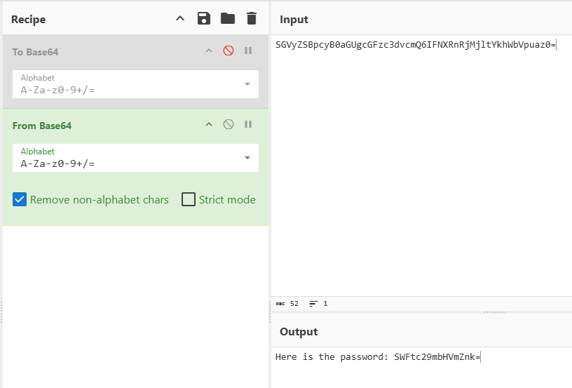

# CyberChef - Hoperation Save McSkidy

# Walkthrough

- Access the web app at `http://<MACHINE_IP>:8080`.
- Click on the Outer Gate.
- Here the chat is base64 encoded and we need to note the guard’s name for each level.
- Inspect the page using `Ctrl+Shift+I` and reload the page in `Network`tab and select the first response.
- For the login logic, switch to the “*Debugger”* tab. Match the lock with the respective logic.

## Task 3: First Lock - Outer Gate

### Answer the questions below

What is the password for the first lock?

> `Iamsofluffy`
> 
- First, identify the guard name and encode it to Base64.
    
    ```jsx
    CottonTail: Q290dG9uVGFpbA==
    ```
    
- For the password, we identify the magic question from Network tab within the Headers section and encode it in Base64.
    
    ```bash
    X-Magic-Question: What is the password for this level?
    ```
    
- After this, use the encoded magic question in the chat (`V2hhdCBpcyB0aGUgcGFzc3dvcmQgZm9yIHRoaXMgbGV2ZWw/`) and click Send. The guard will answer the encoded level password (`SGVyZSBpcyB0aGUgcGFzc3dvcmQ6IFNXRnRjMjltYkhWbVpuaz0=`).
- Now, switch to the ‘*Debugger*’ tab and identify the login logic. In this case, the password is encoded to Base 64.
    
    ```jsx
    // Password login logic
        try {
          if (level === 1) {
            // CyberChef: From Base64
            passOk = btoa(pwd) === expectedConst;
    ```
    
    
    
    Encoded Password
    
    Here, we need to decode the password From Base 64.
    
    
    
    Plaintext Password
    
- Now, login with encoded guard’s name and plaintext password to go to level 3.

## Task 4: **Second Lock - Outer Wall**

### Answer the questions below

What is the password for the second lock?

> `Itoldyoutochangeit!`
> 
1.  Identify the guard's name and save the encoded output for later.
    
    ```jsx
    CarrotHelm: Q2Fycm90SGVsbQ==
    ```
    
2. Extract and encode the magic question and retrieve the encoded password from the guard
    
    ```jsx
    X-Magic-Question: Did you change the password?
    ```
    
    
    
    Encoded the magic question and sent on Bunnygram. The text received is then decoded as below:
    
    
    
    Encoded password received from the guard which in the base64 decoded.
    
3. Login Logic
    
    ```jsx
    else if (level === 2) {
            // CyberChef: Double From Base64
            passOk = btoa(btoa(pwd)) === expectedConst;
    ```
    
4. After decoding it twice from Base64, we get the plaintext password as `Itoldyoutochangeit!`
    
    
    
    Plaintext Password
    
5. Now, login with encoded guard’s name and plaintext password to go to level 3.
    
    ```jsx
    Q2Fycm90SGVsbQ==: Itoldyoutochangeit!
    ```
    

## Task 5: Third **Lock - Guard House**

### Answer the questions below

What is the password for the third lock?

> `BugsBunny`
> 
1.  Identify the guard's name and save the encoded output for later.
    
    ```jsx
    LongEars: TG9uZ0VhcnM=
    ```
    
2. There is no magic question but the `X-Recipe-Key` which will be need in the XOR operation.
    
    ```jsx
    X-Recipe-Key: cyberchef
    ```
    
3. To get the password, you can ask nicely with prompt “Password please.”
    
    
    
    Encoded the prompt and sent on Bunnygram. 
    
4. The password is then decoded as:
    
    
    
5. Login Logic
    
    ```jsx
    else if (level === 3) {
            // CyberChef: From Base64 => XOR(key=recipeKey)
            const bytes = xorWithKey(toBytes(pwd), toBytes(recipeKey));
            const b64 = bytesToBase64(bytes);
            passOk = b64 === expectedConst;
    ```
    
6. Here, we need to decode the password `IQwFFjAWBgsf` as below and we get the plaintext password as `BugsBunny` .
    
    
    
    Plaintext Password
    
7. Now, login with encoded guard’s name and plaintext password to go to level 4.
    
    ```jsx
    TG9uZ0VhcnM= : BugsBunny
    ```
    

## Task 6: **Fourth Lock - Inner Castle**

### Answer the questions below

What is the password for the fourth lock?

> **`passw0rd1`**
> 
1.  Identify the guard's name and save the encoded output for later.
    
    ```jsx
    Lenny: TGVubnk=
    ```
    
2. To get the password, you can ask nicely with prompt “Password please.”
    
    ```jsx
    SGVyZSBpcyB0aGUgcGFzc3dvcmQ6IGI0YzBiZTdkN2U5N2FiNzRjMTMwOTFiNzY4MjVjZjM5
    ```
    
3. The password is then decoded as:
    
    
    
4. Login Logic
    
    ```jsx
    else if (level === 4) {
            // CrackStation: Hash lookup
            passOk = (md5(pwd) === expectedConst)
    ```
    
5. Here, we need to perform lookup for the hash `b4c0be7d7e97ab74c13091b76825cf39` as and we get the plaintext password as **`passw0rd1`**.
    
    
    
6. Now, login with encoded guard’s name and plaintext password to go to level 5.
    
    ```jsx
    **TGVubnk=: passw0rd1**
    ```
    

## Task 7: **Fifth Lock - Prison Tower**

### Answer the questions below

What is the password for the fifth lock?

1.  Identify the guard's name and save the encoded output for later.
    
    ```jsx
    Carl: Q2FybA==
    ```
    
2. Here, there are three different cases for level 5. For our instance we got this headers:
    
    ```jsx
    X-Level: 5
    X-Recipe-ID: R3
    X-Recipe-Key: cyberchef
    ```
    
3. To get the password, you can ask nicely with prompt “Password please.” 
    
    ```jsx
    SGVyZSBpcyB0aGUgcGFzc3dvcmQ6IEl4dERXak9ES05MQlZFSUZPdXlEVHQ9PQ==
    ```
    
4. The password is then decoded as:
    
    
    
5. Login Logic
    
    ```jsx
    case "R3":
                // CyberChef: ROT13 => From Base64 => XOR(key=recipeKey)
                const exed = bytesToBase64(xorWithKey(toBytes(tp), toBytes(recipeKey || "hare")));
                tp = rot13(exed);
                break;
    ```
    
6. Here, we need to perform the reverse logic `ROT13 → From Base64 → XOR(key=cyberchef)`and we get the plaintext password as `51rBr34chBl0ck3r`.
    
    
    
    Plaintext password
    
7. Now, login with encoded guard’s name and plaintext password to get the flag.
    
    ```jsx
    Q2FybA==: 51rBr34chBl0ck3r
    ```
    

---

What is the retrieved flag?

```jsx
You have broken every lock and cleared a path for McSkidy to escape. Here is your flag:

THM{M3D13V4L_D3C0D3R_4D3P7}
```

## Task 8: Epilogue

Looking for the key to **Side Quest 3**? Hopper has left us this [cyberchef link](https://gchq.github.io/CyberChef/#recipe=To_Base64('A-Za-z0-9%2B/%3D')Label('encoder1')ROT13(true,true,false,7)Split('H0','H0%5C%5Cn')Jump('encoder1',8)Fork('%5C%5Cn','%5C%5Cn',false)Zlib_Deflate('Dynamic%20Huffman%20Coding')XOR(%7B'option':'UTF8','string':'h0pp3r'%7D,'Standard',false)To_Base32('A-Z2-7%3D')Merge(true)Generate_Image('Greyscale',1,512)&input=SG9wcGVyIG1hbmFnZWQgdG8gdXNlIEN5YmVyQ2hlZiB0byBzY3JhbWJsZSB0aGUgZWFzdGVyIGVnZyBrZXkgaW1hZ2UuIEhlIHVzZWQgdGhpcyB2ZXJ5IHJlY2lwZSB0byBkbyBpdC4gVGhlIHNjcmFtYmxlZCB2ZXJzaW9uIG9mIHRoZSBlZ2cgY2FuIGJlIGRvd25sb2FkZWQgZnJvbTogCgpodHRwczovL3RyeWhhY2ttZS1pbWFnZXMuczMuYW1hem9uYXdzLmNvbS91c2VyLXVwbG9hZHMvNWVkNTk2MWM2Mjc2ZGY1Njg4OTFjM2VhL3Jvb20tY29udGVudC81ZWQ1OTYxYzYyNzZkZjU2ODg5MWMzZWEtMTc2NTk1NTA3NTkyMC5wbmcKClJldmVyc2UgdGhlIGFsZ29yaXRobSB0byBnZXQgaXQgYmFjayE) as a lead. See if you can recover the key and access the corresponding challenge in our [Side Quest Hub](https://tryhackme.com/adventofcyber25/sidequest)!